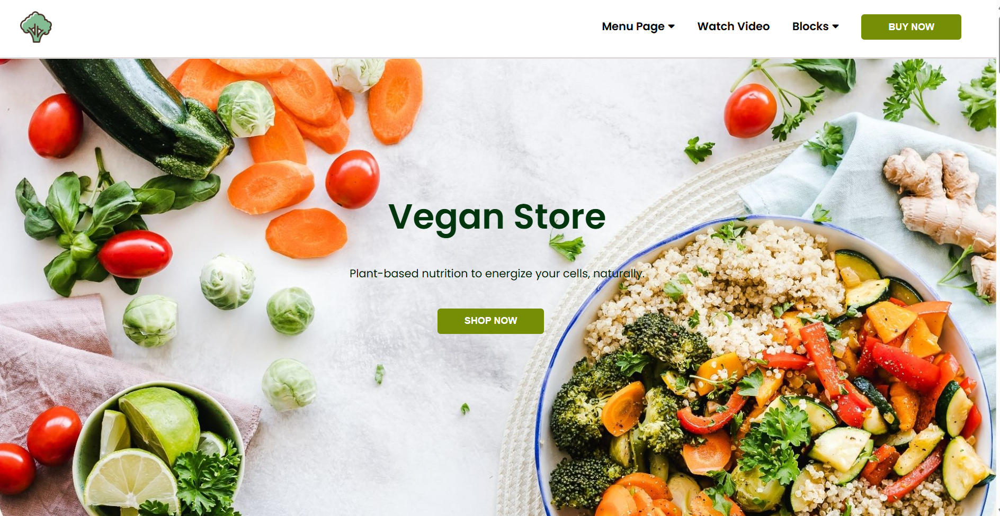

# 🥦 Vegan Store

A clean and modern landing page for a Vegan Store, built using **HTML**, **CSS**, and **Font Awesome** icons. This page is designed to promote plant-based lifestyle and products in a visually appealing and user-friendly format.

## 🌟 Features

- 🌱 Beautiful landing section with bold heading
- 🥕 Step-by-step guide section with icons and info
- 🛒 Store highlights showcasing products and benefits
- 💬 Testimonials from happy customers
- 📽️ Embedded product video from Vimeo
- 📍 Contact information and form
- 📊 Stats section with brand metrics
- 📧 Email subscription box
- 📱 Responsive design 

## 🖼️ Preview

 

## 🌍 Live Demo

[👉 Click here to view on GitHub Pages](https://gajulakavya12.github.io/VeganStore/)

## 🔧 Tech Stack

- HTML5
- CSS3
- Font Awesome Icons
- Google Fonts

## 🧑‍💻 Developed by

**Kavya**

- [GitHub](https://github.com/gajulakavya12)
- [LinkedIn](https://www.linkedin.com/in/gajulakavya12/)

---

## 📂 Project Structure

```plaintext
vegan-store/
│
├── index.html
├── style.css
└── README.md
